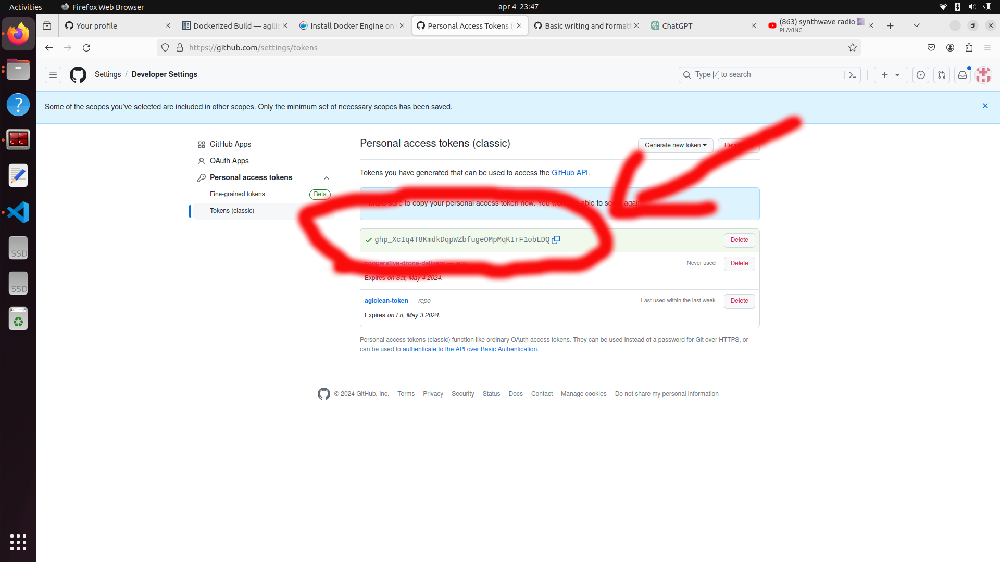

# The Tutorial of Everything

## Introduction
So you are screaming at your computer screen and you can't figure where you went wrong? Well no wories because this document is going to hold your hand as we carry ourselves through all the pain this project delivers you on a daily basis. 

## Table of Content
1. [Cloning GitHub Repository](#cloning-github-repository)
2.


# Cloning GitHub Repository
### Step 1 (opening user settings)


You can open your `user settings` by clicking on the settings tab when clicking on your profile picture.

### Step 2 (opening developer settings)


Now by scrolling all the way down you see a button called `developer settings`, click on this button.

### Step 3 


Generate a new classic token.

### Step 4


Rename your token whatever fits the description best. And make sure that you have `repo` toggled `ON`. Afterwards **scroll all the way down** and click the button `generate token`.

### Step 5 (copy your token)



`Copy this code` and `store it` in a safe place (you will **need this later on**).

### Step 6 (copy HTTPS code)


Navigate to the `cooperative-drone-delivery` GitHub and copy the **HTTPS code**

```https://github.com/FabianDumitrascu/Cooperative-Drone-Delivery-Cables.git```

### Step 7 (navigate to desired directory)

`Navigate inside your terminal` to your desired directory and type: 

```git clone https://github.com/FabianDumitrascu/Cooperative-Drone-Delivery-Cables.git```

then type your **GitHub username** and afterwards fill in your token when having to type your password `password = (replace with your token)`

## Well done

Now you can use GIT command when you are inside of the GIT folder. Use for example `GIT status` to show your current branch and any uncommitted files.


# Accessing agilicious container

## Introduction

Before being able to go on to the next steps we have to make sure you are able to launch your agilicious docker environment. This section assumes that you have cloned the agiclean repository as described [here](#cloning-github-repository), follow these steps, but with the agiclean repository: 

```git clone https://github.com/FabianDumitrascu/agiclean.git```

This section also assumes that you have docker installed. Docker installation guide click [here](https://docs.docker.com/engine/install/linux-postinstall/).

### Step 1 (Clone and navigate)
Clone the agiclean repository in your desired folder and navigate into it with `cd agiclean/`, then make sure the **clone** has been succesfull by doing `ls`


### Step 2 (optional, but recommended)

In this step you will delete all your previous containers/images ***do not dot his step if you have any important work done inside these containers!***

- First of all run `docker container prune`
- Then run `docker images` and copy the **IMAGE ID** of all the images you want to remove. (An image ID looks something like this: `4f443811b07b`)
- Remove all images you want with 

`docker rmi -f replace_this_with_image_id replace_this_with_image_id2` 

an example on my computer looked like this: 

`docker rmi -f 4f443811b07b 51473eb4f8cf`

- Now double check if the images have been removed by running: `docker images`

### Step 3 (building docker image)

While being inside of your cloned agiliclean directory you should 
