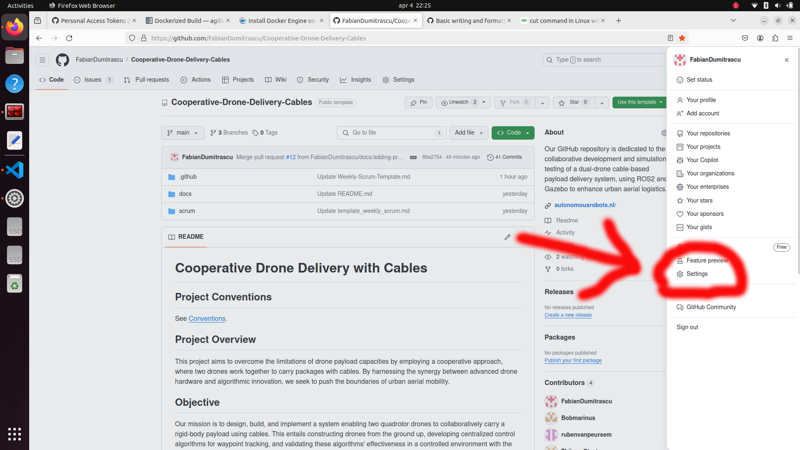
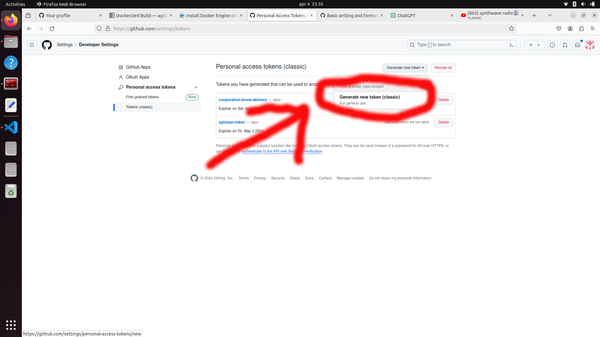
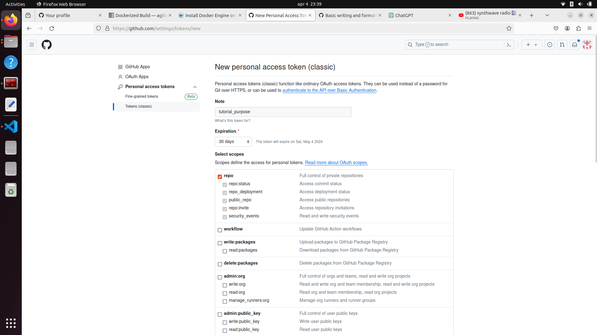

# The Tutorial of Everything

## Introduction
So you are screaming at your computer screen and you can't figure where you went wrong? Well no wories because this document is going to hold your hand as we carry ourselves through all the pain this project delivers you on a daily basis. 

## Table of Content
1. [Cloning GitHub Repository](#cloning-github-repository)
2. [Accessing Agilicious container](#accessing-agilicious-container)
3. [Agilicious Topics and commands](#agilicious-topics-and-commands)


# Cloning GitHub Repository
### Step 1 (opening user settings)




You can open your `user settings` by clicking on the settings tab when clicking on your profile picture.

### Step 2 (opening developer settings)


Now by scrolling all the way down you see a button called `developer settings`, click on this button.

### Step 3 



Generate a new classic token.

### Step 4



Rename your token whatever fits the description best. And make sure that you have `repo` toggled `ON`. Afterwards **scroll all the way down** and click the button `generate token`.

### Step 5 (copy your token)


`Copy this code` and `store it` in a safe place (you will **need this later on**).

### Step 6 (copy HTTPS code)


Navigate to the `cooperative-drone-delivery` GitHub and copy the **HTTPS code**

```https://github.com/FabianDumitrascu/Cooperative-Drone-Delivery-Cables.git```

### Step 7 (navigate to desired directory)

`Navigate inside your terminal` to your desired directory and type: 

```git clone https://github.com/FabianDumitrascu/Cooperative-Drone-Delivery-Cables.git```

then type your **GitHub username** and afterwards fill in your token when having to type your password `password = (replace with your token)`

## Well done

Now you can use GIT command when you are inside of the GIT folder. Use for example `GIT status` to show your current branch and any uncommitted files.


# Accessing agilicious container

## Introduction

Before being able to go on to the next steps we have to make sure you are able to launch your agilicious docker environment. This section assumes that you have cloned the agiclean repository as described [here](#cloning-github-repository), follow these steps, but with the agiclean repository: 

```git clone https://github.com/FabianDumitrascu/agiclean.git```

This section also assumes that you have docker installed. Docker installation guide click [here](https://docs.docker.com/engine/install/linux-postinstall/).

### Step 0 (create a catkin workspace)

First of all lets remove your old catkin_ws with:
- `cd && rm -rf catkin_ws` 

Lets create your catkin_ws now:
- `mkdir -p ~/catkin_ws/src`

### Step 1 (Clone and navigate)
Clone the agiclean repository in your desired folder and navigate into it with `cd agiclean/`, then make sure the **clone** has been succesfull by doing `ls`


The git clone might not clone `catkin_simple` correctly. Inside your `catkin_ws` folder, cd to your `catkin_simple` folder and list its components with `ls`. If you don't see anything, delete the `catkin_simple` folder. Go back to your `catkin_ws` folder and type the following command:
`git clone https://github.com/catkin/catkin_simple`

Check if the `catkin_simple` folder has components.

### Step 2 (optional, but recommended)

In this step you will delete all your previous containers/images ***do not dot his step if you have any important work done inside these containers!***

- First of all run `docker container prune`
- Then run `docker images` and copy the **IMAGE ID** of all the images you want to remove. (An image ID looks something like this: `4f443811b07b`)
- Remove all images you want with 

`docker rmi -f replace_this_with_image_id replace_this_with_image_id2` 

an example on my computer looked like this: 

`docker rmi -f 4f443811b07b 51473eb4f8cf`

- Now double check if the images have been removed by running: `docker images`

### Step 3 (building docker image)

While being inside of your cloned agiclean directory you should  run the following command:

```sudo docker build --tag "ros_agilicious:latest" .``` 

Don't forget to also copy the ''.'' character at the end (''.'' stands for current directory.)

### Step 4 (starting up your agilicious container)

When running 

`./scripts/launch_container.sh <path_to_catkin_ws> <path_to_agiclean_repository>` 

we have two variables we have to add. Namely the path to your **catkin workspace**. In my case my path is: `~/catkin_ws` and my path to agiclean repository is: `~/Documents/FabianGIT/agiclean`

So to run agilicious container my commands would be:

- `cd ~/Documents/FabianGIT/agiclean` this makes sure I am in the root directory of my cloned agiclean GIT repository.

- `./scripts/launch_container.sh ~/catkin_ws ~/Documents/FabianGIT/agiclean` this runs the launch_container which takes me into the agilicious container.

### Step 5 (build your catkin workspace)

Run the following commands:

- `cd ~/catkin_ws`
- `catkin build`

### Step 6 (source your catkin workspace)

Run: `source ~/catkin_ws/devel/setup.bash`

### Step 7 (have fun)

Well done you correctly set everything up. Try using the following command to start a RViz flight simulation

- `roslaunch agiros agisim.launch`


# Agilicious Topics and Commands

## Introduction

In this section we will go over some basic commands inside agilicious. After this section you should be able to send custom commands to your drone inside of Gazebo and see it act accordingly.

## Test your commands (optional step)

In this step we are going to start an instance of a basic simulation. First of all make sure you are inside of your agilicious Docker environment. Then run the following command: `roslaunch agiros simulation.launch gui:=true`

From this point on two things could happen: either you get a black screen, a lot of error messages or your simulation will work. In the case that things are not working **do control C inside of your terminal** (this will close Gazebo) and basically just redo `roslaunch agiros simulation.launch gui:=true`. We don't know for sure why it works the second time you are running this command, but let's just roll with it.

## Step 1 (Opening terminal and checking setup)

Have your Gazebo simulation running on the background.

Open a clean, new terminal. This will be the terminal where you will send your commands. In this terminal open your **launch_container.sh** and go inside of your agilicious docker environment. 

From this point fact-check that you have topics running in the background by running `rostopic list`. Now you should see a screen full of topics you can publish to like shown below.


## Commands List

- `rostopic pub /kingfisher/agiros_pilot/start std_msgs/Empty "{}"`
    - This command makes your drone go to it's starting position which is (x,y,z) = (0,0,1)

- `rostopic pub /kingfisher/agiros_pilot/go_to_pose geometry_msgs/PoseStamped "header:
  seq: 0
  stamp:
    secs: 0
    nsecs: 0
  frame_id: ''
pose:
  position:
    x: 0.0
    y: 0.0
    z: 0.0
  orientation:
    x: 0.0
    y: 0.0
    z: 0.0
    w: 0.0" `

    - With this command you can send your drone to a specifix position with a specifix orientation.

- `rostopic echo /gazebo/model_states`


